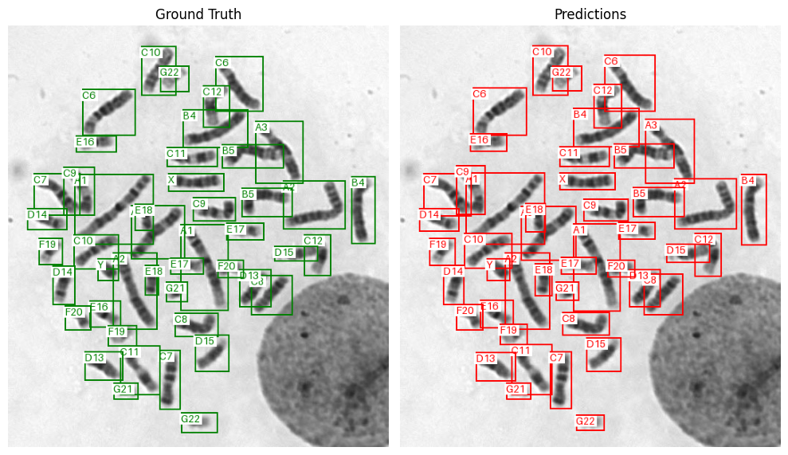
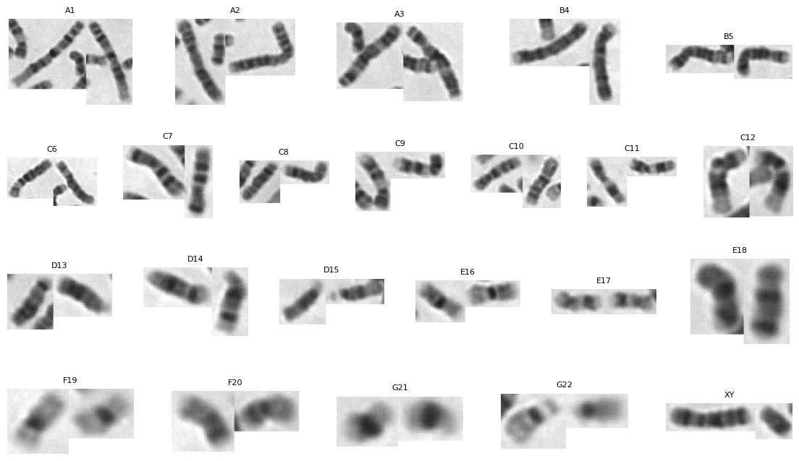
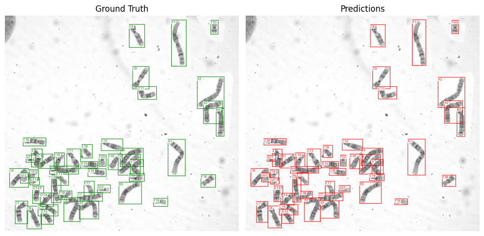
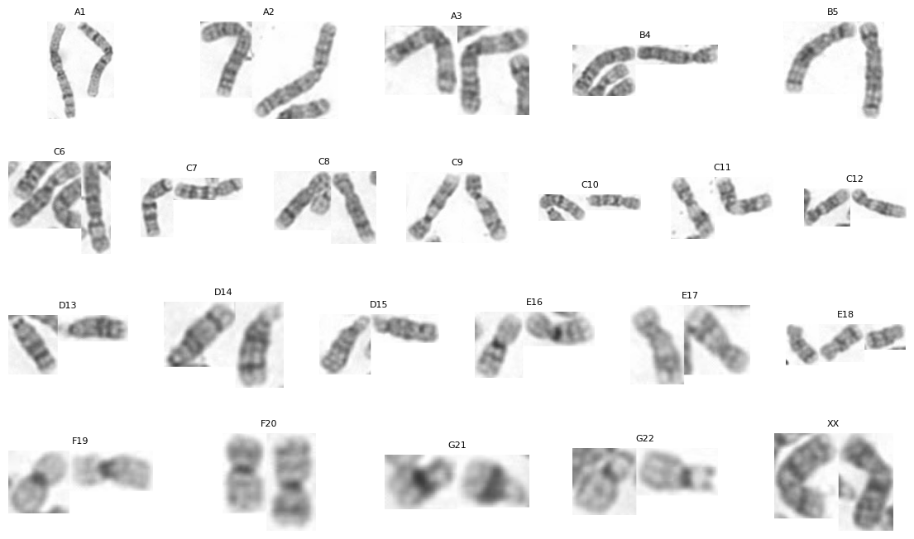

# 🧬 Automation of Human Karyotype Analysis Using Image Segmentation and Classification Methods

Author: [Dmytro Batko](https://www.linkedin.com/in/dmytro-batko-5987921b7/)

Supervisor: [Mykola Klymenko](https://www.linkedin.com/in/nikolay-klimenko-761238108/)

## Overview

The repository contains the implemented code that was used for running experiments of the bachelor’s thesis based on chromosome [dataset](https://drive.google.com/drive/folders/1cSnxqYoAqyOvHm3ZENeASNfWUkD1Pa5m?usp=sharing).

## The Structure of Repository

The repository is divided into the parts - stages of the proposed pipeline in thesis.

Directories:

- Segmentation
    - `Segmentation.ipynb` - main file which loads dataset, train segmentation models and plot results.
    - `models_weights` and `result_plots` - all models weights gathered after training and resulting plots of training (losses and metrics).

- Classification 
    - `Classification.ipynb` - the main notebook used for classifying (with training and plots) using loaded dataset.
    - `models_weights` and `result_plots` - all models weights gathered after training and resulting plots of training (losses and metrics).

- Pipeline
    - `Pipeline.ipynb` - connects both segmentation and classification stages returning ready karyogram for further analysis.

## Results

1. The results presented for healthy male karyotype.

2. The results presented for unhealthy female karyotype (Trisomy 18 or Edwards syndrome).

As can be seen from the images, the pipeline works well, being able to correctly segment and classify the chromosomes from the images.

## Notes for running

The `Pipeline` directory contains all necessary files that will enable to run pipeline (Google Colab recommended for testing).